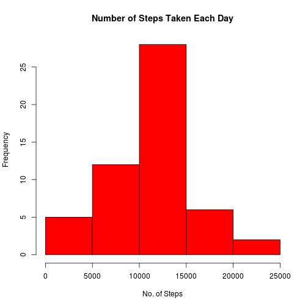
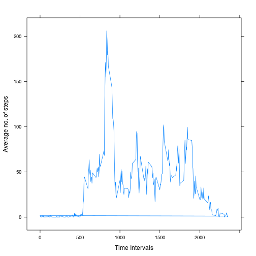
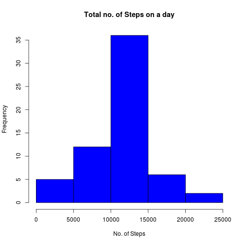
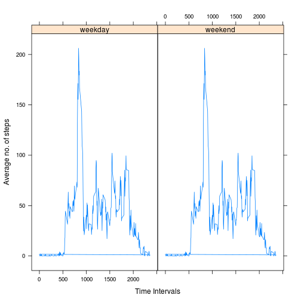

## Loading and preprocessing the data

Data is first downloaded into working directory and unzipped. Rename the unzipped file to activity.csv .
First to get the general idea of the data we take a look at the summary of the data.
Data is read into a variable cData.


```r
data<-read.csv("activity.csv",header=TRUE);
str(data)
```

```
## 'data.frame':	17568 obs. of  3 variables:
##  $ steps   : int  NA NA NA NA NA NA NA NA NA NA ...
##  $ date    : Factor w/ 61 levels "2012-10-01","2012-10-02",..: 1 1 1 1 1 1 1 1 1 1 ...
##  $ interval: int  0 5 10 15 20 25 30 35 40 45 ...
```

## What is mean total number of steps taken per day?

1. We can aggregate the total number of steps taken per day by using aggregate function. 


```r
b<-aggregate(steps~date,data=data,sum,simplify = TRUE)
head(b)
```

```
##         date steps
## 1 2012-10-02   126
## 2 2012-10-03 11352
## 3 2012-10-04 12116
## 4 2012-10-05 13294
## 5 2012-10-06 15420
## 6 2012-10-07 11015
```

2. We plot the histogram using the hist function from base plotting system.


```r
hist(b$steps,col = "Red",main="Number of Steps Taken Each Day",xlab = "No. of Steps")
```

 

3. Mean of the total number of steps taken per day.


```r
mean(b$steps)
```

```
## [1] 10766.19
```

4. Median of the total number of steps taken per day.


```r
median(b$steps)
```

```
## [1] 10765
```

## What is the average daily activity pattern?

We created a variable C containing the number of steps taken in that interval averaged across all days. 
We do load the lattice package in R studio.
We plot it using xyplot from lattice package.


```r
data$c<-(aggregate(steps~interval,data=data,mean,simplify = TRUE))$steps
library(lattice)
xyplot(c~interval,data,type="l",xlab="Time Intervals",ylab = "Average no. of steps")
```

 

Finding the five minute interval that has maximum average number of steps and applying the unique function over the vector r to remove duplicate entries.


```r
r<-data$interval[which(data$c==max(data$c))]
unique(r)
```

```
## [1] 835
```

The five minute interval is 835.

## Imputing missing values

We will use the average number of steps taken in that interval as the computed value. We calculate the total number of entries containing NA's values.


```r
mis<-which(complete.cases(data$steps,data$date,data$interval)==FALSE)
length(mis)
```

```
## [1] 2304
```

```r
m<-which(is.na(data$steps)==TRUE)
length(m)
```

```
## [1] 2304
```

From summarizing the data we found that the NA's values are in the steps variable only.

Creating a new dataset and replacing the NA values with the mean for that time interval.


```r
newdata<-data
newdata$steps[m]<-newdata$c[m]
```

Now finding the new total steps taken for each day by using aggregate function and then plotting a histogram and displaying mean and median.


```r
nb<-aggregate(steps~date,data=newdata,sum,simplify = TRUE)
head(nb)
```

```
##         date    steps
## 1 2012-10-01 10766.19
## 2 2012-10-02   126.00
## 3 2012-10-03 11352.00
## 4 2012-10-04 12116.00
## 5 2012-10-05 13294.00
## 6 2012-10-06 15420.00
```

```r
hist(nb$steps,col = "Blue",main="Total no. of Steps on a day",xlab = "No. of Steps")
```

 

```r
mean(nb$steps)
```

```
## [1] 10766.19
```

```r
median(nb$steps)
```

```
## [1] 10766.19
```

We can clearly see that the mean and median results the same. After replacing the NA's with the new value the mean and median are increased.

## Are there differences in activity patterns between weekdays and weekends?

We creating a new factor variable with two levels weekday and weekend. First we use the strptime and weekdays to find the weekday for each date and then we created a factor variable considering Sunday and Saturday as weekends and rest as weekdays.


```r
newdata$day<-weekdays(strptime(newdata$date,"%Y-%m-%d"))
newdata$dayt<-"weekday"
newdata$dayt[which(newdata$day=='Saturday' | newdata$day=='Sunday')]="weekend"
newdata$dayt<-as.factor(newdata$dayt)
xyplot(c~interval|dayt,newdata,type="l",xlab="Time Intervals",ylab = "Average no. of steps")
```

 

From the plots we can see that there is not much difference in the weekends and weekdays as most of the weekends values are imputed in place of NA's.
